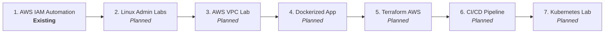

# DevOps Portfolio Roadmap

A structured, project-based engineering roadmap designed to build practical competency across Linux, Cloud (AWS), Infrastructure as Code (Terraform), Containers (Docker/Kubernetes), and CI/CD automation.

> [!NOTE]
> In accordance with portfolio integrity rules, projects are marked as **Planned** until they are actively built, tested, and published to GitHub. Fake repositories or empty shells are strictly avoided.

---

## Portfolio Milestone Progression

---

## Detailed Project Specifications

### Project 1: `aws-iam-user-automation`
* **Status:** **Existing Project (Active Flagship)**
* **Repository:** [aws-iam-user-automation](https://github.com/root-whoami/aws-iam-user-automation)
* **Core Focus:** AWS IAM Provisioning, Bash Scripting, and Terminal Automation.
* **Core Competencies:**
  * Bash script design with strict variable checking (`set -u`) and POSIX utilities.
  * AWS CLI v2 integration with IAM and STS services.
  * Input sanitization, regex pattern matching, and duplicate rejection.
  * Secure credential generation (OpenSSL) with mandatory first-login password rotation.
  * Secure local credential storage with restricted POSIX permissions (`chmod 600`).

---

### Project 2: `linux-server-admin-labs`
* **Status:** **Planned**
* **Core Focus:** Linux System Administration & Operational Automation.
* **Key Topics:**
  * User and group administration with granular permissions (`sudoers`, sticky bits, ACLs).
  * Systemd service unit creation, daemon management, and restart policies.
  * Process monitoring (`ps`, `top`, `kill`, `htop`, signals).
  * SSH hardening: Key-based authentication, non-standard port configuration, and disabling root login.
  * Linux networking: `ip`, `ss`, `netstat`, `iptables`/`ufw` firewall management.
  * Log analysis: `journalctl`, `/var/log` inspection, and log rotation.
  * Automated system health and disk usage monitoring scripts.

---

### Project 3: `aws-vpc-infrastructure-lab`
* **Status:** **Planned**
* **Core Focus:** AWS Cloud Networking & Secure Network Topology.
* **Key Topics:**
  * Custom Virtual Private Cloud (VPC) design with multi-AZ layout.
  * Public and private subnets with proper CIDR block allocation.
  * Internet Gateway (IGW) setup for public route tables.
  * NAT Gateway configuration for outbound egress from private subnets.
  * Security Groups (stateful) and Network ACLs (stateless) implementation.
  * EC2 instance provisioning in private subnets with bastion/SSM Session Manager access.

---

### Project 4: `dockerized-web-app`
* **Status:** **Planned**
* **Core Focus:** Containerization & Microservice Packaging.
* **Key Topics:**
  * Writing optimized, multi-stage `Dockerfile` configurations to minimize image attack surfaces and sizes.
  * Non-root user execution inside containers for security compliance.
  * Port mapping, environment variable injection, and layer caching strategies.
  * Docker volumes for data persistence.
  * User-defined bridge networks for service-to-service communication.
  * Multi-container composition using `docker-compose.yml` (e.g., Python Flask/FastAPI + PostgreSQL/Redis).

---

### Project 5: `terraform-aws-infrastructure`
* **Status:** **Planned**
* **Core Focus:** Infrastructure as Code (IaC) with HashiCorp Terraform & AWS.
* **Key Topics:**
  * Terraform workflow (`init`, `plan`, `apply`, `destroy`).
  * AWS Provider configuration and variable declarations (`variables.tf`, `terraform.tfvars`).
  * State management: Remote state locking using S3 and DynamoDB.
  * Modular architecture: Authoring reusable VPC, security group, and compute modules.
  * Resource outputs (`outputs.tf`) and dependency graphing.
  * Drift detection and plan evaluation.

---

### Project 6: `ci-cd-pipeline-lab`
* **Status:** **Planned**
* **Core Focus:** Continuous Integration & Automated Delivery with GitHub Actions.
* **Key Topics:**
  * GitHub Actions workflow syntax (`.github/workflows/*.yml`).
  * Automated linting (e.g., ShellCheck, Flake8, Terraform fmt).
  * Automated testing triggered on pull requests and branch merges.
  * Secure secrets management via GitHub Repository Secrets and OIDC (OpenID Connect) with AWS.
  * Automated container image build, tagging (SemVer), and push to AWS ECR or Docker Hub.
  * Environment deployment gates and status badges in README.

---

### Project 7: `kubernetes-deployment-lab`
* **Status:** **Planned**
* **Core Focus:** Container Orchestration & Cloud-Native Workloads.
* **Key Topics:**
  * Core Kubernetes architecture: Control plane vs. Worker nodes.
  * Declarative YAML manifests for Pods, ReplicaSets, and Deployments.
  * Service primitives: ClusterIP, NodePort, and LoadBalancer configurations.
  * Application configuration: Decoupling settings via ConfigMaps and Secrets.
  * Resource requests, limits, and liveness/readiness probes.
  * Horizontal Pod Autoscaling (HPA) and rolling update deployment strategies.

---

## Execution Philosophy (1–2 Hours Weekly)

1. **One Project at a Time:** Complete each project end-to-end (code + docs + testing) before starting the next.
2. **Document Everything:** The README of each lab should be comprehensive enough for another engineer to reproduce the setup from scratch.
3. **Clean Teardowns:** Always maintain cleanup scripts or `terraform destroy` workflows to keep cloud lab costs minimal.
