# GitHub Profile & DevOps Portfolio Strategy

A strategic blueprint for building a high-impact GitHub portfolio for entry-level DevOps roles within a sustainable **1–2 hours per week** commitment.

---

## 1. Profile Positioning

* **Target Title:** Aspiring DevOps Engineer / Entry-Level DevOps Engineer.
* **Core Value Proposition:** A software and systems enthusiast with strong foundations in Linux, Bash, and Python, actively mastering AWS cloud infrastructure, containerization, and IaC.
* **Positioning Tone:** Transparent, technical, and quality-driven. Avoid claiming senior-level production experience; instead, showcase rigorous testing, clean documentation, security hygiene, and reproducible automation labs.

---

## 2. Recommended Profile Bio

```text
Aspiring DevOps Engineer | AWS, Linux, Python & Bash | Cloud Automation | Learning Docker, Kubernetes & Terraform
```
* Clear, concise, and within GitHub's 160-character boundary.

---

## 3. Recommended Profile README Structure

The profile README (`root-whoami/README.md`) functions as your technical landing page:
1. **Header & Headline:** Clear positioning statement and career intent.
2. **About Me:** Bullet points focusing on cloud, Linux, scripting, and growth trajectory.
3. **Categorized Tech Stack:** Shields.io badges cleanly grouped by domain (DevOps/Linux, Programming, Web).
4. **Currently Learning Section:** Transparent demarcation of technologies in active development (AWS, Docker, K8s, Terraform).
5. **Practical Focus Areas:** Operational domains you focus on (IAM, VPC, Linux hardening, IaC).
6. **Featured Project Spotlight:** Rich summary card of your flagship project with problem-solution framing.
7. **Activity Metrics:** Reliable, dynamic GitHub statistics and language breakdown.
8. **Contact Information:** Verified links to GitHub, LinkedIn, and professional email.

---

## 4. Recommended Pinned Repositories

GitHub allows you to pin up to 6 repositories on your overview page. Maintain a strict **quality over quantity** standard:

| Slot | Target Repository | Role / Focus | Status |
| :---: | :--- | :--- | :--- |
| **1** | `aws-iam-user-automation` | Cloud IAM Provisioning + Bash Automation | **Flagship (Existing)** |
| **2** | `linux-server-admin-labs` | Linux Systems Administration & Shell Automation | Planned |
| **3** | `aws-vpc-infrastructure-lab` | Cloud Networking Topology & Security Architecture | Planned |
| **4** | `dockerized-web-app` | Containerization, Multi-Stage Builds & Compose | Planned |
| **5** | `terraform-aws-infrastructure` | Infrastructure as Code & AWS Modular Provisioning | Planned |
| **6** | `ci-cd-pipeline-lab` | GitHub Actions Pipeline Automation & Automated Testing | Planned |

> [!NOTE]
> Only pin repositories once they have functional code, full documentation, and passing tests. Do not pin placeholder or empty repositories.

---

## 5. Repository Naming Standards

* **Convention:** `kebab-case` only (lowercase, hyphen-separated).
* **Descriptive & Scoped:** Avoid generic names like `project1` or `devops-practice`. Use explicit names like `aws-iam-user-automation` or `linux-server-admin-labs`.
* **No Redundancy:** Avoid prefixing every repo with your username or redundant terms (e.g., use `ci-cd-pipeline-lab`, not `root-whoami-pipeline-test`).

---

## 6. README Standards (The DevOps Gold Standard)

Every repository must contain a comprehensive `README.md` formatted with:
* **Project Title & One-line Summary:** What the project is and why it exists.
* **Architecture Diagram:** Mermaid.js or ASCII flowchart illustrating data/process flow.
* **Problem Statement:** The real-world operational friction being addressed.
* **Prerequisites & Tool Versions:** Required packages (`aws-cli`, `bash`, `docker`, `terraform`).
* **IAM / Cloud Permissions:** Explicit least-privilege policies required to execute the lab.
* **Step-by-Step Installation & Usage:** Exact terminal commands to clone, configure, and execute.
* **Sanitized Example Output:** Verifiable log outputs using fake placeholder credentials.
* **Security Controls:** Detailed breakdown of how the project protects secrets, handles permissions, and isolates resources.
* **Cleanup & Teardown Instructions:** Commands to delete created cloud resources and avoid accidental cloud billing.

---

## 7. Commit Message Standards

Adopt the **Conventional Commits** specification:
* `feat:` A new feature or script enhancement (e.g., `feat: add IAM user duplicate validation`)
* `fix:` A bug fix or error correction (e.g., `fix: handle non-zero exit code on STS failure`)
* `docs:` Documentation improvements (e.g., `docs: add least-privilege IAM policy to README`)
* `refactor:` Code restructuring without behavioral changes (e.g., `refactor: extract password generator function`)
* `test:` Adding or updating tests or validation scripts (e.g., `test: add Bats unit test for username regex`)
* `chore:` Maintenance, gitignore updates, or dependencies (e.g., `chore: expand .gitignore for secret prevention`)

*Strictly avoid vague messages* such as `update`, `test`, `wip`, `final`, or `changes`.

---

## 8. Documentation Standards

* **In-Code Comments:** Document the *why* rather than the *what*. Explain security considerations (e.g., why `chmod 600` is applied) and non-obvious regex patterns.
* **Architecture Docs:** Store deep technical design documents in a dedicated `docs/` folder (e.g., `docs/architecture.md`).
* **Visual Clarity:** Use tables, callouts (`> [!NOTE]`), and mermaid diagrams to make technical documents easily scannable for engineering managers and recruiters.

---

## 9. Security Standards

* **Zero Secret Commitment:** Never commit AWS Access Keys, Secret Keys, `.pem` files, passwords, API tokens, or `.env` files.
* **Pre-commit Checks:** Always run a local secret scan (e.g., searching for `AKIA`, `PRIVATE KEY`, `.env`) before issuing any `git commit`.
* **Environment-Driven Configuration:** Scripts must consume secrets via environment variables or native CLI credential managers, never hardcoded parameters.
* **Minimal Privileges:** Always provide exact least-privilege IAM policies instead of `AdministratorAccess`.

---

## 10. Contribution Strategy

* **Authentic Growth:** Never fabricate commits or use automated commit spoofers. Engineering hiring managers inspect commit frequency, commit messages, and the depth of code changes.
* **Meaningful Iterations:** Split project development into sensible pull requests or structured commits as features, docs, and tests are implemented.
* **Open Source Engagement:** As confidence grows, make small documentation fixes, issue reproductions, or feature contributions to active DevOps open-source tools.

---

## 11. Recruiter Readability Checklist

When an engineering manager or recruiter reviews your profile within 30 seconds, they should immediately find:
- [x] Clear title: Aspiring / Entry-level DevOps Engineer.
- [x] Clear skills list without buzzword overload.
- [x] Clear distinction between current skills and actively learning technologies.
- [x] At least one standout pinned project with high-quality architecture and usage documentation.
- [x] Professional contact links (GitHub, LinkedIn, professional email).
- [x] Clean commit history showing disciplined version control practices.

---

## 12. Weekly Maintenance Plan (1–2 Hours/Week)

With 1–2 hours available each week, consistency is the key to compounding progress:

```mermaid
gantt
    title Typical 2-Hour Weekly Sprint
    dateFormat  m
    axisFormat %M min
    section Weekly Allocation
    Review & Tech Reading / Docs   :a1, 0, 30m
    Hands-on Coding / Lab Building :a2, after a1, 60m
    Documentation, Git Commit & Review :a3, after a2, 30m
```



* **Minutes 0–30 (Concept & Planning):** Read official documentation for the current roadmap target (e.g., AWS VPC documentation or Dockerfile best practices).
* **Minutes 30–90 (Hands-on Building):** Implement a single discrete script, configuration, or lab exercise in a local branch.
* **Minutes 90–120 (Documentation & Git Hygiene):** Update the project `README.md`, verify security patterns, write a clean conventional commit, and review the changes.
