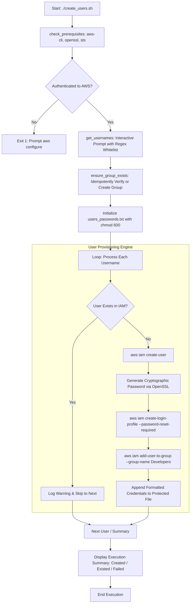

# Ancil Ouseppachen

### Aspiring DevOps & Cloud Infrastructure Engineer
**Linux** &bull; **Python** &bull; **Bash** &bull; **AWS** &bull; **Cloud Automation** &bull; **Infrastructure as Code**

---

## Profile Overview

I am an entry-level DevOps engineer with a degree in Computer Science, focused on **Linux systems administration**, **Python and Bash automation**, and **AWS cloud infrastructure**. My engineering approach emphasizes security-first principles, idempotent automation, and declarative workflows.

I build reproducible lab environments and automation scripts designed to solve concrete operational challenges—from batch IAM provisioning and credential hardening to automated systems monitoring and cloud networking.

---

## Core Technical Competencies

| Domain | Technologies & Tooling | Focus & Practical Application |
| :--- | :--- | :--- |
| **Cloud Infrastructure** | **Amazon Web Services (AWS)** | Identity and Access Management (IAM), AWS STS, Virtual Private Cloud (VPC), EC2, S3, Security Groups, Route Tables |
| **Operating Systems & Shell** | **Linux (Ubuntu, Debian), Bash** | POSIX shell scripting, systemd service management, process auditing, SSH hardening, file permissions (`chmod`, `chown`) |
| **Programming & Automation** | **Python 3, Java, C** | Terminal automation, API integration, data sanitization, CLI scripting, foundational algorithms |
| **Actively Learning** | **Docker, Kubernetes, Terraform** | Container lifecycle & multi-stage builds, Pod/Deployment manifests, HCL modular infrastructure |
| **Version Control & Workflows** | **Git, GitHub** | Conventional commits, branch management, repository hygiene, security scanning, `.gitignore` policy |
| **Web Foundations** | **HTML5, CSS3, JavaScript** | Web fundamentals, RESTful architecture concepts, client-server communication |

---

## Engineering Standards & Practices

* **Least Privilege Access:** Enforce granular IAM policies with explicit resource constraints; avoid administrative wildcards (`*`).
* **Idempotent Automation:** Author automation scripts that evaluate state before mutating resources to prevent duplicate entities or execution failures.
* **Credential Hygiene:** Zero credentials in version control. Sensitive local outputs are restricted using POSIX permissions (`chmod 600`), and all console credentials require mandatory initial rotation (`--password-reset-required`).
* **Documentation as a Deliverable:** Every repository contains full architectural diagrams, least-privilege policy definitions, step-by-step reproduction commands, and cost-preventing teardown procedures.

---

## Featured Engineering Project

### 🔐 [aws-iam-user-automation](https://github.com/root-whoami/aws-iam-user-automation)
> **Automated AWS IAM User Provisioning, Group Management, and Credential Security**

A production-style Bash automation utility utilizing the **AWS CLI v2** to batch-provision IAM users, enforce password complexity and rotation policies, assign users to functional IAM groups, and protect temporary credentials locally.

#### Architecture Workflow

* **Core Highlights:** Input validation via regex whitelist (`^[a-zA-Z0-9+=,.@-]{1,64}$`), duplicate rejection, idempotent group and user checks, OpenSSL random passwords, forced first-login password reset, and restricted `chmod 600` file output.
* **Documentation:** [README](https://github.com/root-whoami/aws-iam-user-automation/blob/main/README.md) &bull; [Architecture Design](https://github.com/root-whoami/aws-iam-user-automation/blob/main/docs/architecture.md) &bull; [Script Source](https://github.com/root-whoami/aws-iam-user-automation/blob/main/create_users.sh)

---

## DevOps Portfolio Roadmap

A progressive 7-phase lab curriculum designed to demonstrate end-to-end cloud and systems engineering competency:

| Phase | Repository / Lab | Primary Competencies | Status |
| :---: | :--- | :--- | :---: |
| **01** | [**`aws-iam-user-automation`**](https://github.com/root-whoami/aws-iam-user-automation) | AWS IAM API, Bash automation, OpenSSL, input validation, credential hygiene | **Completed** |
| **02** | `linux-server-admin-labs` | User/group permissions, systemd service units, process monitoring, SSH hardening | **Up Next** |
| **03** | `aws-vpc-infrastructure-lab` | Multi-AZ VPC, Public/Private subnets, Internet Gateway, NAT Gateway, Route tables | Planned |
| **04** | `dockerized-web-app` | Multi-stage Docker builds, non-root execution, container networking, Compose | Planned |
| **05** | `terraform-aws-infrastructure` | Infrastructure as Code, S3 remote state locking, DynamoDB, modular resources | Planned |
| **06** | `ci-cd-pipeline-lab` | GitHub Actions workflow, automated linting, test runners, AWS deployment | Planned |
| **07** | `kubernetes-deployment-lab` | Declarative YAML, Deployments, ClusterIP/NodePort Services, ConfigMaps, Secrets | Planned |

---

## GitHub Analytics

  
  

  <i>Note: Language statistics reflect codebase composition across public GitHub repositories, not personal proficiency levels.</i>

---

## Professional Contact & Links

* **GitHub:** [https://github.com/root-whoami](https://github.com/root-whoami)
* **LinkedIn:** `[Add LinkedIn Profile]` *(Placeholder — to be updated with verified link)*
* **Professional Email:** `[Add Verified Professional Email]` *(Placeholder — to be updated with verified email)*
